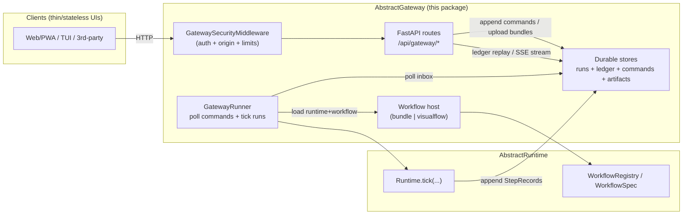

# AbstractGateway — Architecture

> Status: implemented (v0.1.0)  
> Last reviewed: 2026-02-04

AbstractGateway is a **durable run gateway** for AbstractRuntime:
- **Start runs** (and optionally schedule them)
- Accept **durable commands** (`pause`, `resume`, `cancel`, `emit_event`, …)
- Let clients **replay** the durable ledger and optionally **stream** updates (SSE)

This document describes the code in this repository (see **Evidence** links).

## High-level shape

## Core components (code-mapped)

- **HTTP API**: `src/abstractgateway/app.py` mounts routers under `/api` (`/api/gateway/*` is the main surface).
- **Security layer** (ASGI middleware):
  - Protects `/api/gateway/*` with bearer token auth + origin allowlist + request limits.
  - Implemented in `src/abstractgateway/security/gateway_security.py`.
- **Durable stores** (file or SQLite):
  - Built by `src/abstractgateway/stores.py` (`build_file_stores`, `build_sqlite_stores`).
  - Store types come from `abstractruntime` (RunStore, LedgerStore, CommandStore, ArtifactStore).
- **Workflow host** (what “workflows” mean in this gateway):
  - `bundle` (default): load `.flow` WorkflowBundles and compile VisualFlow JSON via `abstractruntime.visualflow_compiler` (`src/abstractgateway/hosts/bundle_host.py`).
  - `visualflow` (optional): load VisualFlow JSON from `*.json` files via `abstractflow` (`src/abstractgateway/hosts/visualflow_host.py`).
  - Wired in `src/abstractgateway/service.py` (`create_default_gateway_service`).
- **Runner worker**:
  - Polls the durable command inbox and applies commands; ticks RUNNING runs forward (`src/abstractgateway/runner.py`).
  - A filesystem lock (`gateway_runner.lock`) prevents double-ticking in split-process deployments.

## Durable contract (replay-first)

The gateway is intentionally **replay-first**:
- The **durable ledger** is the source of truth.
- SSE (`/ledger/stream`) is an optimization; clients should reconnect by replaying from a cursor.

This contract is stated and implemented in `src/abstractgateway/routes/gateway.py` (ledger endpoints + SSE) and `src/abstractgateway/runner.py` (StepRecord append semantics).

## Deployment shape: one process vs split API/runner

Supported patterns:
- **Single process**: `abstractgateway serve` starts both the HTTP API and the background runner (FastAPI lifespan + service composition).
- **Split**: run `abstractgateway runner` (worker) and `abstractgateway serve --no-runner` (API) against the same `ABSTRACTGATEWAY_DATA_DIR`.

Evidence:
- CLI flags and runner env toggles: `src/abstractgateway/cli.py`
- Runner lock file: `src/abstractgateway/runner.py`

## Workflow sources (bundle vs visualflow)

### Bundle mode (recommended)

- Input: `*.flow` files (WorkflowBundles) under `ABSTRACTGATEWAY_FLOWS_DIR` (file or directory).
- Internals:
  - Bundles are opened with `abstractruntime.workflow_bundle.open_workflow_bundle`.
  - VisualFlow JSON is namespaced (`bundle@version:flow`) and compiled via `compile_visualflow`.
  - “Dynamic flows” (e.g. schedules) are persisted under `<data_dir>/dynamic_flows/` and reloaded on startup.

Evidence: `src/abstractgateway/hosts/bundle_host.py` (`WorkflowBundleGatewayHost.load_from_dir`).

### VisualFlow directory mode (compatibility)

- Input: `*.json` VisualFlow files under `ABSTRACTGATEWAY_FLOWS_DIR`.
- Requires the `abstractflow` compiler library (`pip install "abstractgateway[visualflow]"`).

Evidence: `src/abstractgateway/hosts/visualflow_host.py` (`_require_visualflow_deps`, `VisualFlowRegistry`).

## Security model (gateway endpoints)

`GatewaySecurityMiddleware` applies only to paths starting with `/api/gateway`:
- **Bearer token auth** (`ABSTRACTGATEWAY_AUTH_TOKEN` / `ABSTRACTGATEWAY_AUTH_TOKENS`)
- **Origin allowlist** (`ABSTRACTGATEWAY_ALLOWED_ORIGINS`, glob patterns supported)
- **Abuse resistance** (body size caps, concurrency caps, auth lockouts, optional audit log)

Evidence: `src/abstractgateway/security/gateway_security.py` (`GatewayAuthPolicy`, `load_gateway_auth_policy_from_env`, middleware `__call__`).

## Evidence (jump-to-code)

- Composition root: `src/abstractgateway/service.py` (`create_default_gateway_service`, `start_gateway_runner`)
- API surface: `src/abstractgateway/routes/gateway.py` (everything under `/api/gateway/*`)
- Runner semantics: `src/abstractgateway/runner.py` (`GatewayRunner`)
- Store backends: `src/abstractgateway/stores.py`
- Security policy + middleware: `src/abstractgateway/security/gateway_security.py`
- CLI + split runner: `src/abstractgateway/cli.py`

## Related docs

- Getting started (run + stores): [getting-started.md](./getting-started.md)
- Configuration (env vars): [configuration.md](./configuration.md)
- API overview (client contract): [api.md](./api.md)
- Security guide: [security.md](./security.md)
- Operator tooling (triage/backlog/process manager): [maintenance.md](./maintenance.md)
