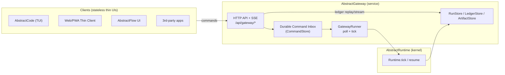

# AbstractGateway — Architecture (Living)

> Created: 2026-01-07  
> Status: implemented (see completed backlog 318)

AbstractGateway is the **deployable control-plane host** for AbstractRuntime runs:
- clients submit **durable commands** (start/resume/pause/cancel/emit_event)
- clients render by replaying/streaming the **append-only ledger** (cursor-based)
- the gateway host owns the durable stores and is the single authority for a run (ADR‑0020)

## Diagram (v0)

## Scope and packaging
AbstractGateway should be deployable without installing authoring tools (AbstractFlow).
Workflow loading must therefore be pluggable:
- core `abstractgateway` depends on `abstractruntime`
- optional extras can add workflow sources (e.g. VisualFlow JSON via `abstractflow`, or FlowBundles later)

## Related
- Backlog 318: `docs/backlog/completed/318-framework-abstractgateway-extract-run-gateway-host.md`
- ADR‑0018: `docs/adr/0018-durable-run-gateway-and-remote-host-control-plane.md`
- ADR‑0020: `docs/adr/0020-agent-host-pool-and-orchestrator-placement.md`

