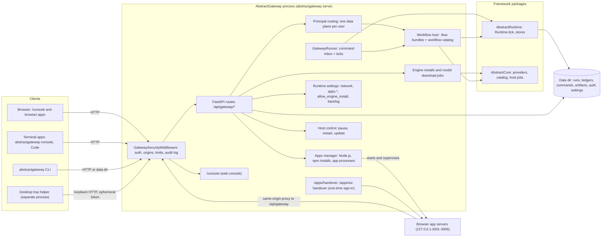
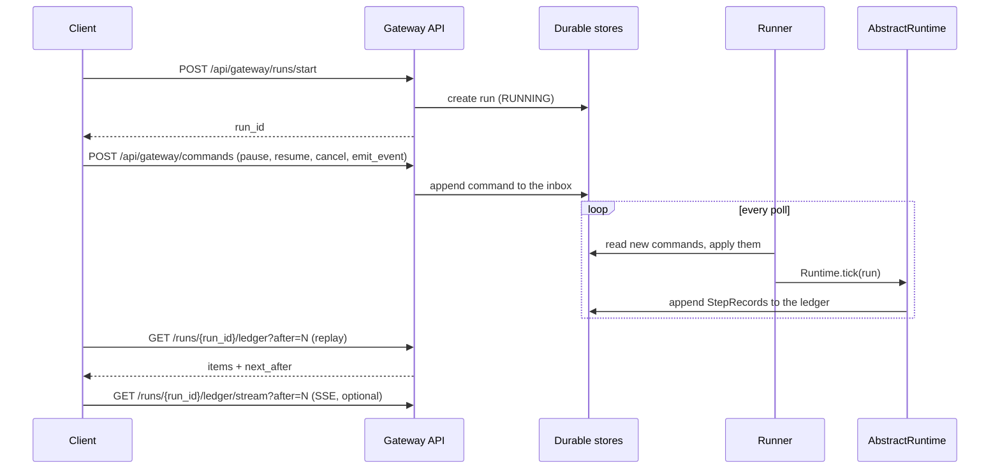
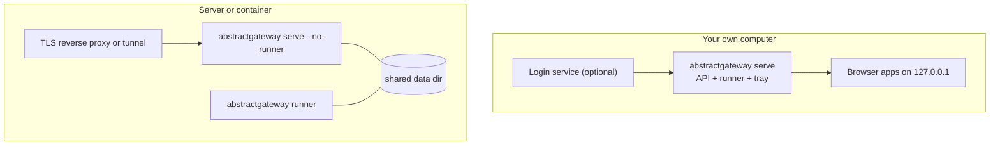

# AbstractGateway — Architecture

AbstractGateway is a **durable run gateway** for AbstractRuntime, and the
control plane of an AbstractFramework installation:

- clients **start runs** (and optionally schedule them);
- clients act through **durable commands** (`pause`, `resume`, `cancel`,
  `emit_event`, …);
- clients **replay** the durable ledger and optionally **stream** it (SSE);
- operators manage users, providers, capability defaults, local engines,
  models, browser apps and network exposure from one place (the web console,
  the terminal console, the CLI, or the desktop tray).

This page describes the components in this repository and how they connect.
For the endpoints, see [api.md](./api.md); for settings, see
[configuration.md](./configuration.md).

## Ecosystem placement (AbstractFramework)

AbstractGateway sits between **clients** (browser apps, terminal apps, the
desktop Assistant, scripts) and **AbstractRuntime**:

- **AbstractGateway** (this package): HTTP/SSE API, durability glue, security,
  and the operator control plane.
- **AbstractRuntime** (required): run model, tick loop, workflow registry and
  stores.
- **AbstractCore** (required, reached through Runtime facades): providers,
  tools, media capabilities, capability-route defaults, the model catalog,
  engine detection and host jobs (downloads, deletes).
- **AbstractAgent** and **AbstractMemory** (required by the default install):
  agent nodes and KG memory for bundle execution.
- Higher-level apps (optional): AbstractFlow (authoring), AbstractCode,
  AbstractObserver, AbstractContinuum, AbstractEntity and AbstractAssistant.

## System overview

```mermaid
flowchart LR
  subgraph Clients["Clients"]
    Browser["Browser: /console and browser apps"]
    TUI["Terminal apps: abstractgateway-console, Code"]
    Tray["Desktop tray helper (separate process)"]
    CLI["abstractgateway CLI"]
  end

  subgraph GW["AbstractGateway process (abstractgateway serve)"]
    Sec["GatewaySecurityMiddleware: auth, origins, limits, audit log"]
    Routes["FastAPI routes /api/gateway/*"]
    Console["/console (web console)"]
    Handover["/apps/handover, /apps/tui-handover (one-time sign-in)"]
    Principals["Principal routing: one data plane per user"]
    Runner["GatewayRunner: command inbox + ticks"]
    Host["Workflow host: .flow bundles + workflow catalog"]
    Settings["Runtime settings: network, apps.*, allow_engine_install, backlog"]
    AppsMgr["Apps manager: Node.js, npm installs, app processes"]
    Jobs["Engine installs and model download jobs"]
    HostCtl["Host control: pause, restart, update"]
  end

  subgraph Lower["Framework packages"]
    RT["AbstractRuntime: Runtime.tick, stores"]
    Core["AbstractCore: providers, catalog, host jobs"]
  end

  Data[("Data dir: runs, ledgers, commands, artifacts, auth, settings")]
  Apps["Browser app servers (127.0.0.1:3001-3005)"]

  Browser -->|HTTP| Sec
  TUI -->|HTTP| Sec
  CLI -->|HTTP or data dir| Sec
  Tray -->|loopback HTTP, ephemeral token| Sec
  Sec --> Routes
  Sec --> Console
  Routes --> Principals --> Host
  Routes --> Settings
  Routes --> AppsMgr
  Routes --> Jobs
  Routes --> HostCtl
  Runner --> Host
  Runner --> RT
  Host --> RT
  RT --> Data
  Routes --> Data
  Jobs --> Core
  Host --> Core
  AppsMgr -->|starts and supervises| Apps
  Handover --> Apps
  Apps -->|same-origin proxy to /api/gateway| Sec
```

## Core components (code-mapped)

- **HTTP app** (`src/abstractgateway/app.py`): mounts the routers under `/api`
  (`/api/gateway/*` is the main surface), `/api/health`, `/console`,
  `/docs` (Swagger UI) and the app handover routes.
- **Security layer** (`src/abstractgateway/security/`): the
  `GatewaySecurityMiddleware` protects `/api/gateway/*` with user or token
  auth, an origin allowlist, request limits, auth lockouts and an audit log.
  Browser sessions, principals and the route-family authorization table live
  in the same package. See [security.md](./security.md).
- **Composition root** (`src/abstractgateway/service.py`): builds the stores,
  the workflow host and the runner. With user auth on, each principal is
  routed to its own service and data plane under
  `<data dir>/users/<tenant>/<runtime>/`.
- **Durable stores** (`src/abstractgateway/stores.py`): file-backed (default)
  or SQLite, using AbstractRuntime's RunStore, LedgerStore, CommandStore and
  ArtifactStore.
- **Workflow host** (`src/abstractgateway/hosts/bundle_host.py`): loads `.flow`
  WorkflowBundles and compiles their VisualFlow JSON with
  `abstractruntime.visualflow_compiler`. Bundle mode is the only workflow
  source; store VisualFlows through `/api/gateway/visualflows/*` and publish
  them as bundles.
- **Workflow catalog** (`src/abstractgateway/workflow_catalog.py`): shared,
  immutable workflow versions with admin-managed default pointers and ACLs.
  Catalog runs execute in the caller's runtime; the gateway signs the
  catalog's workflow policy before Runtime receives it.
- **Runner** (`src/abstractgateway/runner.py`): polls the durable command
  inbox, applies commands and ticks RUNNING runs. A filesystem lock
  (`gateway_runner.lock`) prevents double-ticking when API and runner run as
  separate processes; lock state is reported on `GET /api/health`.
- **Runtime settings** (`src/abstractgateway/runtime_config.py`): one store,
  `<data dir>/config/runtime_config.json`, for the settings the consoles, the
  tray and the CLI change: network exposure, `apps.*`, `allow_engine_install`,
  the backlog folder, the backlog exec runner, the process manager and the
  stop kill switch. See [configuration.md](./configuration.md).
- **Network exposure** (`src/abstractgateway/network_exposure.py`): resolves the
  bind (`localhost`, `lan`, `internet`) at `serve` time, checks that the auth
  posture allows it, discovers the addresses, and serves the reverse-proxy
  settings the security middleware reads per request.
- **Engines and model downloads** (`src/abstractgateway/engines_install.py`,
  `src/abstractgateway/model_downloads.py`, `routes/engines.py`): engine
  installs are gateway jobs; model downloads, deletes and the catalog come from
  AbstractCore's host job registry and model catalog, which the gateway serves
  unchanged and extends with parent jobs, cancel and an event stream. See
  [engines.md](./engines.md) and [model-downloads.md](./model-downloads.md).
- **Apps manager** (`src/abstractgateway/apps_manager.py`, `apps_desktop.py`,
  `routes/apps.py`): installs Node.js when needed, installs the browser apps
  from npm, runs them as child processes of the gateway, detects apps started
  elsewhere, installs Code's terminal app, and opens apps signed in through
  one-time handover codes. See [apps.md](./apps.md).
- **Host control** (`src/abstractgateway/host_control.py`,
  `self_update.py`): process-wide pause, graceful restart, and in-place
  update checks.
- **Desktop tray** (`src/abstractgateway/tray_supervisor.py`, `tray/`): a
  helper process started by `serve` on a desktop session. It talks to the
  gateway over loopback with a per-process token handed over on stdin. See
  [tray.md](./tray.md).
- **Login service** (`src/abstractgateway/os_service.py`, `autostart.py`):
  the per-user LaunchAgent, systemd user unit, XDG autostart entry or Windows
  Run entry that starts plain `abstractgateway serve` at login. See
  [first-run.md](./first-run.md#4-start-the-gateway-at-login-optional).
- **Summoned entities** (`src/abstractgateway/entities.py`,
  `routes/entities.py`): persistent entity homes and their lifecycle. See
  [entities.md](./entities.md).
- **Operator tooling** (`src/abstractgateway/maintenance/`): reports, triage,
  backlog browsing, the backlog exec runner and the process manager. See
  [maintenance.md](./maintenance.md).

## Durable contract (replay-first)

The gateway is **replay-first**:

- the **durable ledger** is the source of truth;
- SSE (`/ledger/stream`) is an optimization; clients reconnect by replaying
  from their last cursor.

```mermaid
sequenceDiagram
  participant C as Client
  participant G as Gateway API
  participant S as Durable stores
  participant R as Runner
  participant RT as AbstractRuntime

  C->>G: POST /api/gateway/runs/start
  G->>S: create run (RUNNING)
  G-->>C: run_id
  C->>G: POST /api/gateway/commands (pause, resume, cancel, emit_event)
  G->>S: append command to the inbox
  loop every poll
    R->>S: read new commands, apply them
    R->>RT: Runtime.tick(run)
    RT->>S: append StepRecords to the ledger
  end
  C->>G: GET /runs/{run_id}/ledger?after=N (replay)
  G-->>C: items + next_after
  C->>G: GET /runs/{run_id}/ledger/stream?after=N (SSE, optional)
```

Evidence: `src/abstractgateway/routes/gateway.py` (ledger endpoints, SSE,
commands) and `src/abstractgateway/runner.py` (command application, ticks).

## Thin-client control plane

Higher-level apps use the gateway instead of importing Runtime or Core:

- `GET /api/gateway/discovery/capabilities` exposes a versioned shared
  contract: run input/history access, media endpoints, voice contracts,
  prompt-cache surfaces, host state, session caches, model residency, and
  `common.readiness` (a compact summary of Gateway-owned surface readiness).
- Provider, model and voice catalogs are routed through the gateway and carry
  a `gateway_catalog_v1` envelope (`catalog` plus canonical `items`) next to
  the lower-layer fields.
- Direct run-scoped media routes cover TTS, STT, image generation, edit and
  upscale, text-to-video, image-to-video, and music.
- Voice listen is a host-capture contract: clients capture audio and then
  upload it or emit an event.
- Model residency is Runtime/provider-owned and Gateway-normalized:
  `GET /models/loaded` and `GET /host/state` relay Runtime's host records and
  add `model_residency_row_v1` rows. The gateway never fabricates residency,
  memory or GPU facts; unavailable sections degrade in-band.
- Reads (`/models/loaded`, `/host/state`, `/host/metrics/*`,
  `GET /sessions/prompt_cache`) serve any authenticated principal; mutations
  (model load/unload/lock/download, prompt-cache clearing, installs) require an
  admin.

## Deployment shapes

```mermaid
flowchart TB
  subgraph Desktop["Your own computer"]
    LS["Login service (optional)"] --> Serve1["abstractgateway serve<br/>API + runner + tray"]
    Serve1 --> AppsLocal["Browser apps on 127.0.0.1"]
  end
  subgraph Server["Server or container"]
    API["abstractgateway serve --no-runner"] --- DD[("shared data dir")]
    Worker["abstractgateway runner"] --- DD
    Proxy["TLS reverse proxy or tunnel"] --> API
  end
```

- **Single process**: `abstractgateway serve` starts the HTTP API and the
  runner. On a desktop session it also starts the tray helper, and it starts
  the browser apps you enabled.
- **Split API and runner**: `abstractgateway runner` (worker) and
  `abstractgateway serve --no-runner` (API) share one data dir, so you can
  restart the API without pausing durable execution.
- **Container**: the GHCR image runs `serve` with user auth; see
  [deployment.md](./deployment.md).

Evidence: `src/abstractgateway/cli.py` (flags), `src/abstractgateway/runner.py`
(lock file).

## Security model (summary)

`GatewaySecurityMiddleware` applies to paths starting with `/api/gateway`:

- **Authentication**: Gateway user accounts (browser sessions or user bearer
  tokens), or a shared server/operator token.
- **Origin allowlist**: the loopback origins, the gateway's own LAN origins in
  a network mode, and the `allowed_origins` setting.
- **Abuse resistance**: body size caps, concurrency caps, auth lockouts, audit
  log.

`session_id`, `run_id`, `artifact_id` and memory owner ids are references,
not authorization proofs. With user auth on, each principal runs on its own
data plane; browser apps exchange a user token for an HTTP-only session cookie
plus CSRF token. See [security.md](./security.md).

## Evidence (jump-to-code)

- Composition root: `src/abstractgateway/service.py`
- API surface: `src/abstractgateway/routes/` (`gateway.py`, `apps.py`,
  `engines.py`, `network.py`, `entities.py`)
- Runner: `src/abstractgateway/runner.py`
- Stores: `src/abstractgateway/stores.py`
- Security: `src/abstractgateway/security/`
- Settings: `src/abstractgateway/runtime_config.py`
- CLI: `src/abstractgateway/cli.py`

## Related docs

- [getting-started.md](./getting-started.md): run the gateway and choose stores
- [configuration.md](./configuration.md): every setting and environment variable
- [api.md](./api.md): the client contract
- [security.md](./security.md): auth, origins, network exposure
- [deployment.md](./deployment.md): containers and Compose
- [faq.md](./faq.md) and [troubleshooting.md](./troubleshooting.md)
