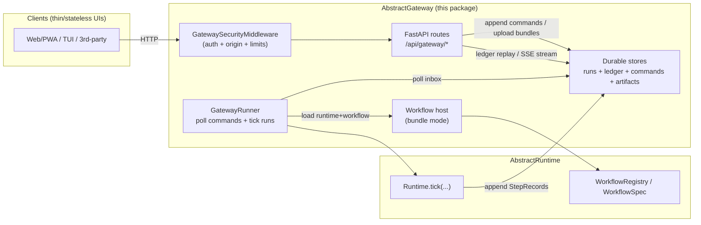

# AbstractGateway — Architecture

> Status: implemented (main branch)
> Last reviewed: 2026-08-27

AbstractGateway is a **durable run gateway** for AbstractRuntime:
- **Start runs** (and optionally schedule them)
- Accept **durable commands** (`pause`, `resume`, `cancel`, `emit_event`, …)
- Let clients **replay** the durable ledger and optionally **stream** updates (SSE)

This document describes the code in this repository (see **Evidence** links).

## Ecosystem placement (AbstractFramework)

AbstractGateway is designed to sit between **thin clients / UIs** and **AbstractRuntime**:
- AbstractGateway: HTTP/SSE API + durability glue + baseline security (`src/abstractgateway/app.py`, `src/abstractgateway/routes/gateway.py`)
- AbstractRuntime (required): run model + tick loop + stores (`pyproject.toml`, `src/abstractgateway/runner.py`)
- AbstractRuntime + transitive capability packages (required by the default server install): Runtime owns the LLM/tool/media integration boundary; Gateway uses its discovery/run facades for prompt-cache controls, generated image/video/voice/audio/music capabilities, and KG-backed bundle execution (`src/abstractgateway/hosts/bundle_host.py`)

## High-level shape

```mermaid
flowchart LR
  subgraph Clients["Clients (thin/stateless UIs)"]
    UI["Web/PWA / TUI / 3rd-party"]
  end

  subgraph GW["AbstractGateway (this package)"]
    Sec["GatewaySecurityMiddleware\n(auth + origin + limits)"]
    API["FastAPI routes\n/api/gateway/*"]
    Runner["GatewayRunner\npoll commands + tick runs"]
    Host["Workflow host\n(bundle mode)"]
    Stores["Durable stores\nruns + ledger + commands + artifacts"]
  end

  subgraph RT["AbstractRuntime"]
    Runtime["Runtime.tick(...)"]
    Registry["WorkflowRegistry / WorkflowSpec"]
  end

  UI -->|HTTP| Sec --> API
  API -->|append commands / upload bundles| Stores
  API -->|ledger replay / SSE stream| Stores
  Runner -->|poll inbox| Stores
  Runner -->|load runtime+workflow| Host
  Host --> Registry
  Runner --> Runtime
  Runtime -->|append StepRecords| Stores
```

## Core components (code-mapped)

- **HTTP API**: `src/abstractgateway/app.py` mounts routers under `/api` (`/api/gateway/*` is the main surface).
- **Security layer** (ASGI middleware):
  - Protects `/api/gateway/*` with bearer token auth + origin allowlist + request limits.
  - Implemented in `src/abstractgateway/security/gateway_security.py`.
- **Durable stores** (file or SQLite):
  - Built by `src/abstractgateway/stores.py` (`build_file_stores`, `build_sqlite_stores`).
  - Store types come from `abstractruntime` (RunStore, LedgerStore, CommandStore, ArtifactStore).
- **Workflow host** (what “workflows” mean in this gateway):
  - `bundle` (default): load `.flow` WorkflowBundles and compile VisualFlow JSON via `abstractruntime.visualflow_compiler` (`src/abstractgateway/hosts/bundle_host.py`).
  - Wired in `src/abstractgateway/service.py` (`create_default_gateway_service`).
- **Workflow catalog**:
  - Gateway-owned metadata and immutable bundle bytes for shared/default
    workflows.
  - Private runtime bundles remain per-principal; catalog bundles are loaded
    into each user's host under internal bundle ids so private ids cannot
    shadow catalog ids.
  - Run start and schedule routes resolve catalog ACL/default policy before
    execution; catalog runs still execute in the caller's runtime.
  - Gateway signs catalog workflow-policy snapshots before Runtime receives
    them, and direct private-bundle routes reject catalog-internal ids.
- **Runner worker**:
  - Polls the durable command inbox and applies commands; ticks RUNNING runs forward (`src/abstractgateway/runner.py`).
  - A filesystem lock (`gateway_runner.lock`) prevents double-ticking in split-process deployments. Refused acquisition is retried continuously (never one-shot), a live wrong holder is asked to yield via a one-shot takeover request (`gateway_runner.takeover`, newest process wins), the holder heartbeats the lock file mtime, and lock state is surfaced on `GET /api/health` plus `StartRunResponse.runner_warning` when nobody provably ticks the data dir.

## Durable contract (replay-first)

The gateway is intentionally **replay-first**:
- The **durable ledger** is the source of truth.
- SSE (`/ledger/stream`) is an optimization; clients should reconnect by replaying from a cursor.

This contract is stated and implemented in `src/abstractgateway/routes/gateway.py` (ledger endpoints + SSE) and `src/abstractgateway/runner.py` (StepRecord append semantics).

## Thin-client control plane

Gateway also acts as the control plane for higher-level apps such as
AbstractFlow, AbstractAssistant, and AbstractObserver:

- `GET /api/gateway/discovery/capabilities` exposes a versioned shared contract
  for run input/history access, media endpoints, voice contracts, prompt-cache
  surfaces, host state, session-cache enumeration, and model residency truth
  (`common.model_residency` with `row_schema` and the canonical `modality_ui`
  color map, `common.host_state`, `common.session_caches`).
- Provider/model catalogs are intentionally routed through Gateway. The legacy
  lower-layer payload fields are preserved, but Gateway now adds a stable
  `gateway_catalog_v1` envelope plus canonical `items` so higher apps can stop
  carrying route-local parsing logic.
- Gateway also exposes `common.readiness` as a compact surface-level summary
  for thin clients and operator UIs. That summary is deliberately limited to
  Gateway-owned contract truth; deeper backend/provider diagnostics still
  belong below Gateway.
- Direct run-scoped media routes currently include TTS, STT, image generation,
  image edit, and music generation.
- Voice listen is intentionally a host-capture contract, not a server-side
  microphone transport. Gateway tells clients how to emit or upload captured
  audio; clients keep ownership of live capture UX.
- Model residency, host state/metrics, session prompt-cache enumeration,
  prompt-cache lifecycle, durable blocs, and discovery catalogs are
  server-owned control-plane surfaces so higher apps do not have to import
  Runtime/Core packages directly.
- Model residency truth is Runtime/provider-owned and Gateway-normalized:
  `GET /models/loaded` and `GET /host/state` relay Runtime's host facade
  records and add frozen `model_residency_row_v1` rows in which provider
  residency booleans outrank runtime lease booleans, state strings can only
  confirm residency (never deny it), and unknown values stay `null`. Gateway
  never fabricates residency, memory, or GPU truth; unavailable sections
  degrade in-band instead of failing the snapshot.
- Host and residency surfaces follow a read/mutation authorization split:
  reads (`/models/loaded`, `/models/context_estimate`, `/host/state`,
  `/host/metrics/*`, `GET /sessions/prompt_cache`) serve any authenticated
  principal, while mutations (`/models/load|unload|lock|unlock|download`,
  prompt-cache mutations including `clear_all`) require an admin principal.
- The shared contract is principal-aware for high-trust actions. Regular users
  see admin-only workspace artifact import/export and provider prompt-cache
  controls as unavailable in discovery, while ordinary run/ledger/artifact
  upload, KG query, provider/model discovery, and per-principal defaults remain
  available in their routed runtime.

## Deployment shape: one process vs split API/runner

Supported patterns:
- **Single process**: `abstractgateway serve` starts both the HTTP API and the background runner (FastAPI lifespan + service composition).
- **Split**: run `abstractgateway runner` (worker) and `abstractgateway serve --no-runner` (API) against the same `ABSTRACTGATEWAY_DATA_DIR`.

Evidence:
- CLI flags and runner env toggles: `src/abstractgateway/cli.py`
- Runner lock file: `src/abstractgateway/runner.py`

## Workflow sources (bundle)

### Bundle mode (recommended)

- Input: `*.flow` files (WorkflowBundles) under `ABSTRACTGATEWAY_FLOWS_DIR` (file or directory).
- Internals:
  - Bundles are opened with `abstractruntime.workflow_bundle.open_workflow_bundle`.
  - VisualFlow JSON is namespaced (`bundle@version:flow`) and compiled via `compile_visualflow`.
  - “Dynamic flows” (e.g. schedules) are persisted under `<data_dir>/dynamic_flows/` and reloaded on startup.

Evidence: `src/abstractgateway/hosts/bundle_host.py` (`WorkflowBundleGatewayHost.load_from_dir`).

### Workflow catalog

The workflow catalog is a control-plane registry for shared workflows. It is
separate from the caller's private bundle directory:

- user-visible discovery: `GET /api/gateway/workflow-catalog`;
- admin mutation: `/api/gateway/admin/workflow-catalog/*`;
- immutable bundle bytes: existing `bundle_id@version` content cannot be
  replaced with different bytes;
- default pointers: omitted catalog versions resolve through the admin-managed
  pointer, not semver order;
- status: deprecated, blocked, and tombstoned versions cannot start new runs.

Gateway stores catalog metadata under the root Gateway data dir and loads
tenant catalog bundle bytes into each per-principal runtime host. Runtime still
executes workflows; Gateway owns the authorization decision.

The implemented catalog scope is `tenant_catalog`. `framework_catalog` is
reserved for a later cross-tenant distribution model and is rejected by the API
until host loading and policy semantics exist for it.

### VisualFlow directory mode

VisualFlow directory mode was intentionally removed. Store VisualFlows through
`/api/gateway/visualflows/*`, publish a `.flow` WorkflowBundle via
`POST /api/gateway/visualflows/{flow_id}/publish`, and run in bundle mode.

## Security model (gateway endpoints)

`GatewaySecurityMiddleware` applies only to paths starting with `/api/gateway`:
- **Bearer token auth** (`ABSTRACTGATEWAY_AUTH_TOKEN` / `ABSTRACTGATEWAY_AUTH_TOKENS`)
- **Origin allowlist** (`ABSTRACTGATEWAY_ALLOWED_ORIGINS`, glob patterns supported)
- **Abuse resistance** (body size caps, concurrency caps, auth lockouts, optional audit log)

Evidence: `src/abstractgateway/security/gateway_security.py` (`GatewayAuthPolicy`, `load_gateway_auth_policy_from_env`, middleware `__call__`).

Bearer tokens are gateway-level control-plane credentials, not tenant or
browser-session identities. `session_id`, `run_id`, `artifact_id`, and memory
owner ids are references/correlation fields, not authorization proofs. Deploy a
separate Gateway/runtime/data plane per independent user or tenant unless all
users are a trusted cohort that may share runs, artifacts, workflows, memory,
workspaces, tools, provider credentials, and audit scope. Hosted user-auth mode
routes each principal to a separate GatewayService data plane; browser apps
exchange user tokens for opaque session cookies plus CSRF rather than storing
raw bearer tokens. Session prompt-cache names include a private principal scope
in their hash to avoid cross-user key collisions. See [security.md](security.md).

## Evidence (jump-to-code)

- Composition root: `src/abstractgateway/service.py` (`create_default_gateway_service`, `start_gateway_runner`)
- API surface: `src/abstractgateway/routes/gateway.py` (everything under `/api/gateway/*`)
- Runner semantics: `src/abstractgateway/runner.py` (`GatewayRunner`)
- Store backends: `src/abstractgateway/stores.py`
- Security policy + middleware: `src/abstractgateway/security/gateway_security.py`
- CLI + split runner: `src/abstractgateway/cli.py`

## Related docs

- Getting started (run + stores): [getting-started.md](./getting-started.md)
- FAQ: [faq.md](./faq.md)
- Configuration (env vars): [configuration.md](./configuration.md)
- API overview (client contract): [api.md](./api.md)
- Security guide: [security.md](./security.md)
- Operator tooling (triage/backlog/process manager): [maintenance.md](./maintenance.md)
