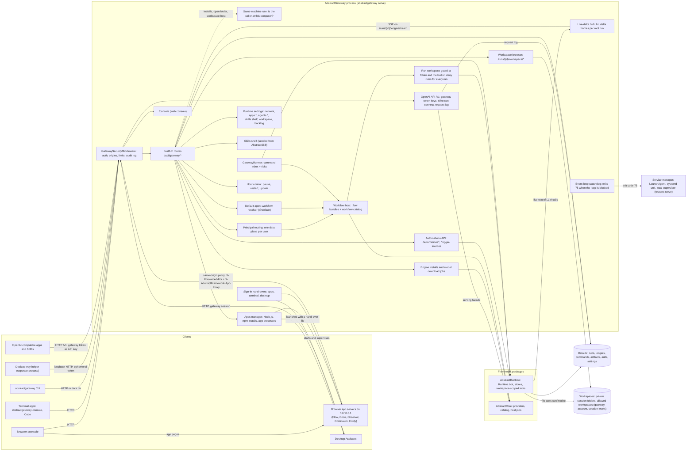
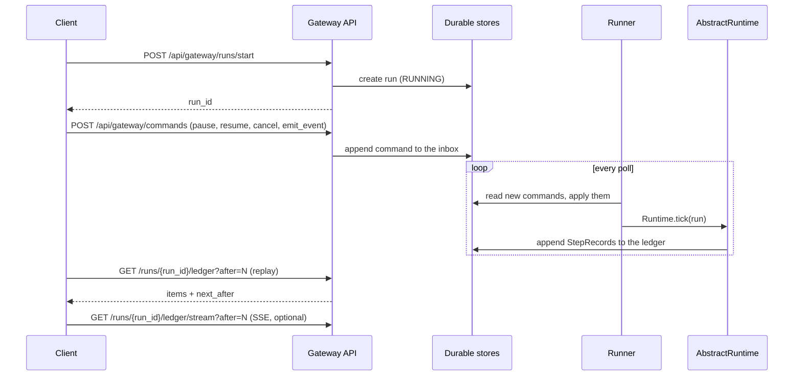
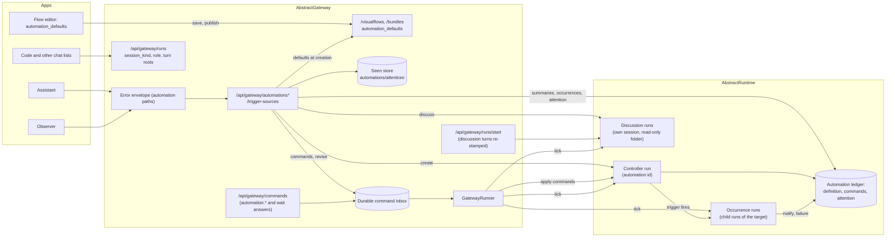
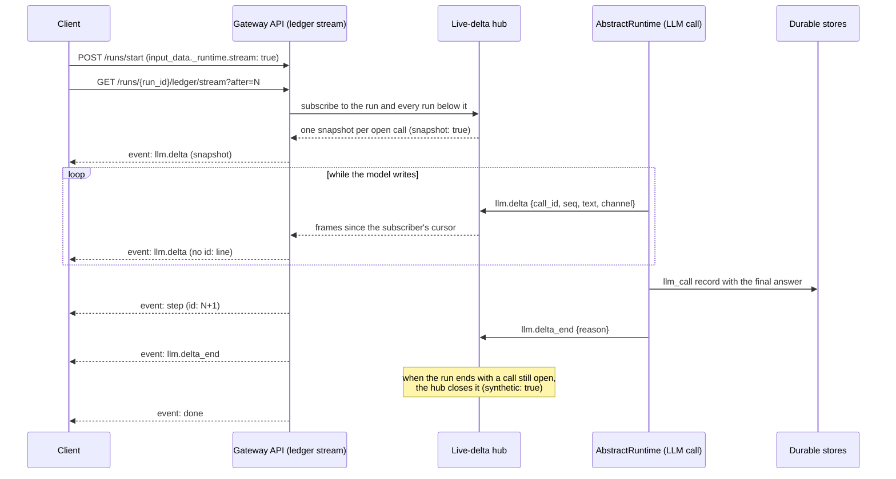
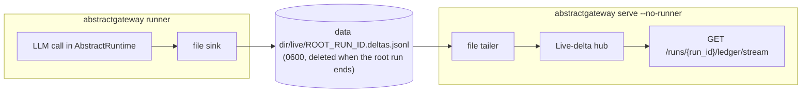
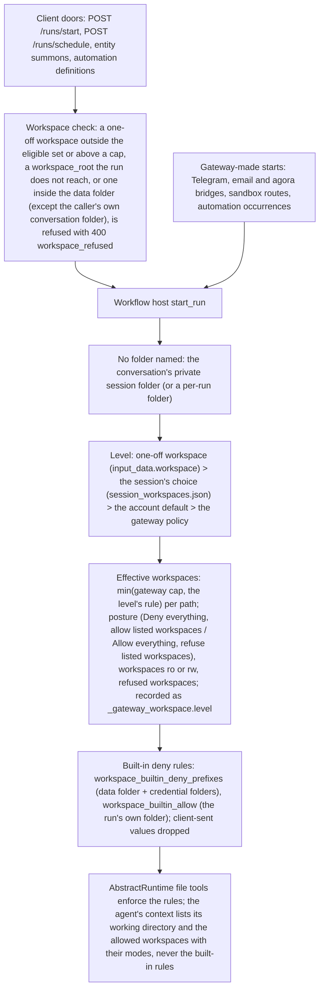
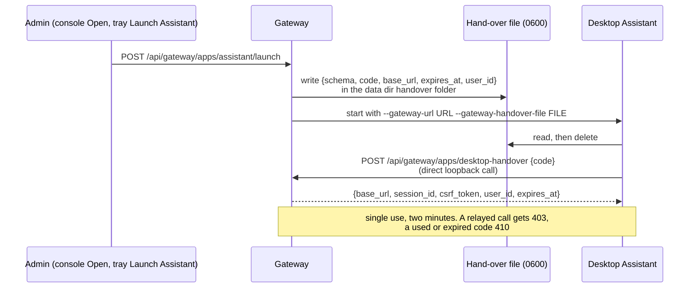
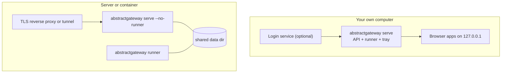

# AbstractGateway — Architecture

AbstractGateway is a **durable run gateway** for AbstractRuntime, and the
control plane of an AbstractFramework installation:

- clients **start runs**, and create **automations** that run a workflow on
  a trigger;
- clients act through **durable commands** (`pause`, `resume`, `cancel`,
  `emit_event`, …);
- clients **replay** the durable ledger and optionally **stream** it (SSE);
- operators manage users, providers, capability defaults, local engines,
  models, browser apps and network exposure from one place (the web console,
  the terminal console, the CLI, or the desktop tray).

This page describes the components in this repository and how they connect.
For the endpoints, see [api.md](./api.md); for settings, see
[configuration.md](./configuration.md).

## Ecosystem placement (AbstractFramework)

AbstractGateway sits between **clients** (browser apps, terminal apps, the
desktop Assistant, scripts) and **AbstractRuntime**:

- **AbstractGateway** (this package): HTTP/SSE API, durability glue, security,
  and the operator control plane.
- **AbstractRuntime** (required, 0.7.0 or later): run model, tick loop, workflow registry, stores,
  live token deltas, the workspace-scoped tools, the automation controller and the session history window.
  The gateway checks the installed runtime when it builds its workflow host and
  refuses to start on an older one, naming the version to install.
- **AbstractCore** (required, reached through Runtime facades): providers,
  tools, media capabilities, capability-route defaults, the model catalog,
  engine detection and host jobs (downloads, deletes).
- **AbstractAgent** and **AbstractMemory** (required by the default install):
  agent nodes and KG memory for bundle execution.
- Higher-level apps (optional): AbstractFlow (authoring), AbstractCode,
  AbstractObserver, AbstractContinuum, AbstractEntity and AbstractAssistant.

## System overview

```mermaid
flowchart LR
  subgraph Clients["Clients"]
    Browser["Browser: /console"]
    AppSrv["Browser app servers on 127.0.0.1<br/>(Flow, Code, Observer, Continuum, Entity)"]
    TUI["Terminal apps: abstractgateway-console, Code"]
    Asst["Desktop Assistant"]
    Tray["Desktop tray helper (separate process)"]
    CLI["abstractgateway CLI"]
    OAI["OpenAI-compatible apps and SDKs"]
  end

  subgraph GW["AbstractGateway process (abstractgateway serve)"]
    Sec["GatewaySecurityMiddleware: auth, origins, limits, audit log"]
    Same["Same-machine rule: is the caller at this computer?"]
    Routes["FastAPI routes /api/gateway/*"]
    Console["/console (web console)"]
    Handover["Sign-in hand-overs: apps, terminal, desktop"]
    Principals["Principal routing: one data plane per user"]
    Defaults["Default agent workflow resolver (@default)"]
    Browse["Workspace browser: /runs/{id}/workspace/*"]
    Autom["Automations API: /automations*, /trigger-sources"]
    Host["Workflow host: .flow bundles + workflow catalog"]
    Guard["Run workspace guard: a folder and the built-in deny rules for every run"]
    Hub["Live-delta hub: llm.delta frames per root run"]
    Runner["GatewayRunner: command inbox + ticks"]
    Settings["Runtime settings: network, apps.*, agents.*, skills.shelf, workspace, backlog"]
    Skills["Skills shelf (seeded from AbstractSkill)"]
    AppsMgr["Apps manager: Node.js, npm installs, app processes"]
    Jobs["Engine installs and model download jobs"]
    HostCtl["Host control: pause, restart, update"]
    V1["OpenAI API /v1: gateway-token keys, Who can connect, request log"]
    Watchdog["Event-loop watchdog: exits 75 when the loop is blocked"]
  end

  subgraph Lower["Framework packages"]
    RT["AbstractRuntime: Runtime.tick, stores, workspace-scoped tools"]
    Core["AbstractCore: providers, catalog, host jobs"]
  end

  Data[("Data dir: runs, ledgers, commands, artifacts, auth, settings")]
  WS[("Workspaces: private session folders, allowed workspaces (gateway, account, session levels)")]
  SvcMgr["Service manager: LaunchAgent, systemd unit, local supervisor (restarts serve)"]

  Browser -->|HTTP| Sec
  Browser -->|app pages| AppSrv
  AppSrv -->|"same-origin proxy: X-Forwarded-For + X-AbstractFramework-App-Proxy"| Sec
  TUI -->|HTTP| Sec
  Asst -->|HTTP, gateway session| Sec
  CLI -->|HTTP or data dir| Sec
  Tray -->|loopback HTTP, ephemeral token| Sec
  OAI -->|"HTTP /v1, gateway token as API key"| Sec
  Sec --> V1
  V1 -->|serving facade| Core
  V1 -->|request log| Data
  Sec --> Routes
  Sec --> Console
  Routes -.->|installs, open folder, workspace host| Same
  Routes --> Principals --> Host
  Routes --> Defaults --> Host
  Routes --> Browse --> WS
  Routes --> Autom --> RT
  Routes --> Settings
  Routes --> Skills
  Routes --> AppsMgr
  Routes --> Jobs
  Routes --> HostCtl
  Host --> Guard --> RT
  Runner --> Host
  Runner --> RT
  RT -->|file tools confined to| WS
  RT -->|live text of LLM calls| Hub
  Hub -->|"SSE on /runs/{id}/ledger/stream"| Routes
  RT --> Data
  Routes --> Data
  Jobs --> Core
  Host --> Core
  AppsMgr -->|starts and supervises| AppSrv
  AppsMgr -->|launches with a hand-over file| Asst
  Handover --> AppSrv
  Handover --> Asst
  Watchdog -.->|"exit code 75"| SvcMgr
```

Browser apps reach the gateway through their own app server on this computer,
which relays every call with the browser's address (`X-Forwarded-For`) and its
marker header (`X-AbstractFramework-App-Proxy`), so the gateway can tell a
browser on this computer from one elsewhere on the network
([security.md](./security.md#callers-on-this-computer)).

## Core components (code-mapped)

- **HTTP app** (`src/abstractgateway/app.py`): mounts the routers under `/api`
  (`/api/gateway/*` is the main surface), `/api/health`, `/console`,
  `/docs` (Swagger UI) and the app handover routes.
- **Security layer** (`src/abstractgateway/security/`): the
  `GatewaySecurityMiddleware` protects `/api/gateway/*` with user or token
  auth, an origin allowlist, request limits, auth lockouts and an audit log.
  Browser sessions, principals and the route-family authorization table live
  in the same package. See [security.md](./security.md).
- **Composition root** (`src/abstractgateway/service.py`): builds the stores,
  the workflow host and the runner. With user auth on, each principal is
  routed to its own service and data plane under
  `<data dir>/users/<tenant>/<runtime>/`.
- **Durable stores** (`src/abstractgateway/stores.py`): file-backed (default)
  or SQLite, using AbstractRuntime's RunStore, LedgerStore, CommandStore and
  ArtifactStore.
- **Workflow host** (`src/abstractgateway/hosts/bundle_host.py`): loads `.flow`
  WorkflowBundles and compiles their VisualFlow JSON with
  `abstractruntime.visualflow_compiler`. Bundle mode is the only workflow
  source; store VisualFlows through `/api/gateway/visualflows/*` and publish
  them as bundles.
- **Workflow catalog** (`src/abstractgateway/workflow_catalog.py`): shared,
  immutable workflow versions with admin-managed default pointers and ACLs.
  Catalog runs execute in the caller's runtime; the gateway signs the
  catalog's workflow policy before Runtime receives it.
- **Runner** (`src/abstractgateway/runner.py`): polls the durable command
  inbox, applies commands and ticks RUNNING runs. A filesystem lock
  (`gateway_runner.lock`) prevents double-ticking when API and runner run as
  separate processes; lock state is reported on `GET /api/health`.
- **Runtime settings** (`src/abstractgateway/runtime_config.py`): one store,
  `<data dir>/config/runtime_config.json`, for the settings the consoles, the
  tray and the CLI change: network exposure, `apps.*`, `allow_engine_install`,
  `agents.default_workflow.<interface>`, `agents.streaming_default`,
  `skills.shelf`, `workspace_builtin_deny`, the backlog folder, the backlog
  exec runner, the process manager and the stop kill switch. A write that
  names an unknown setting is refused whole; writers take a file lock. See
  [configuration.md](./configuration.md).
- **Default agent workflows** (`src/abstractgateway/agent_defaults.py`):
  resolves `flow_id: "@default"` plus an agent `interface` to the workflow
  saved under `agents.default_workflow.<interface>` (or the built-in default)
  at every run start, for the HTTP routes, the Telegram bridge and the backlog
  advisor alike, and records the choice as `resolved_workflow`. See
  [configuration.md](./configuration.md#default-agent-workflow).
- **Run workspace guard** (`src/abstractgateway/run_workspace_guard.py`):
  called from the workflow host's `start_run` for every run, whatever started
  it. It gives a run that named no folder its conversation's gateway-made
  folder, and adds the built-in deny rules (see
  [Workspace guard](#workspace-guard-every-run-start)).
- **Workspace browser** (`src/abstractgateway/workspace_browse.py`): lists
  and serves the files of a run's workspace folder to the person who started
  the run, confined to that folder, with the built-in deny list applied at
  every call. See [api.md](./api.md#a-runs-workspace-folder-browse-and-preview).
- **Live replies** (`src/abstractgateway/live_deltas.py`): the sink the
  gateway registers on every runtime it builds, the in-memory hub keyed by
  root run, and the file sink and tailer used when API and runner are separate
  processes (see [Live replies](#live-replies-token-deltas)).
- **Skills shelf** (`src/abstractgateway/skills_shelf.py`): resolves the
  folder skills are read from (`skills.shelf`, else the gateway's own copy in
  `<data dir>/skills/registry`, refreshed from AbstractSkill's curated shelf
  at each start). See [configuration.md](./configuration.md#skills-shelf).
- **Same-machine rule** (`src/abstractgateway/security/same_machine.py`):
  one answer to "is this caller sitting at the gateway computer?", used for
  installs, opening folders and the workspace routes' host facts. See
  [security.md](./security.md#callers-on-this-computer).
- **Network exposure** (`src/abstractgateway/network_exposure.py`): resolves the
  bind (`localhost`, `lan`, `internet`) at `serve` time, checks that the auth
  posture allows it, discovers the addresses, and serves the reverse-proxy
  settings the security middleware reads per request.
- **OpenAI API** (`src/abstractgateway/core_endpoint.py`,
  `routes/core_endpoint.py`): serves the OpenAI-compatible API at `/v1` on the
  gateway listener. The security middleware resolves the caller's gateway
  token to an account; this layer applies the account's **OpenAI API** switch,
  Open mode (Guest or the chosen account), *Who can connect* and the request
  log in the audit log, then hands the request to AbstractCore's serving
  routes through AbstractRuntime's serving facade. See
  [openai-api.md](./openai-api.md).
- **Event-loop watchdog** (`src/abstractgateway/loop_watchdog.py`): under
  `serve`, a tick on the event loop and a checker thread; when the loop has
  not run for `--watchdog-seconds` (default 30) the gateway writes the blocked
  stacks to its log and to an incident file (`<data dir>/incidents/watchdog-<UTC
  stamp>.json` + `.threads.txt`) and exits with code 75, so the LaunchAgent,
  systemd unit or local supervisor restarts it. The next process reads the
  newest incident; the console's Resources page (Gateway card, "Last restart")
  and the terminal console show "Gateway restarted at <time> after a hang —
  <reason>". `GET /api/health` reports its state. See
  [deployment.md](./deployment.md).
- **Nothing blocks the event loop** (R13.1): a request body that arrived
  without a Content-Length (the console's `/apps/<id>/` proxy streams bodies)
  is buffered by the security middleware and replayed through
  `asgi_receive.replay_body_receive`, which suspends after the body (a replay
  that kept answering "empty body" made every streaming response's disconnect
  listener a busy loop — the 2026-10-04 watchdog incident). Streamed speech
  (`voice_stream.py`) holds one permit of the voice synthesis bound
  (`ABSTRACTGATEWAY_VOICE_MAX_CONCURRENCY`) from engine setup until its engine
  thread ends, sets up and pulls the engine on worker threads, and hands
  events to the loop through a bounded queue; a busy engine is announced to
  the client with a `queued` line. Reading a reply aloud is never a wait of
  the run: the durable child run is recorded completed when the stream ends,
  and the runner closes any streamed-speech wait an older process left
  behind.
- **Session and model-file housekeeping** (`src/abstractgateway/session_archive.py`,
  `model_download_delete.py`): archive and unarchive a conversation (history
  kept), and delete a downloaded model's files with the engine's own
  mechanism, refused while the model is loaded, locked or downloading.
- **Engines and model downloads** (`src/abstractgateway/engines_install.py`,
  `src/abstractgateway/model_downloads.py`, `routes/engines.py`): engine
  installs are gateway jobs; model downloads, deletes and the catalog come from
  AbstractCore's host job registry and model catalog, which the gateway serves
  unchanged and extends with parent jobs, cancel and an event stream. See
  [engines.md](./engines.md) and [model-downloads.md](./model-downloads.md).
- **Apps manager** (`src/abstractgateway/apps_manager.py`, `apps_desktop.py`,
  `routes/apps.py`): installs Node.js when needed, installs the browser apps
  from npm, runs them as child processes of the gateway, detects apps started
  elsewhere, installs Code's terminal app, and opens apps signed in through
  one-time handover codes; it starts the desktop Assistant signed in through a
  private hand-over file (see [Desktop hand-over](#desktop-assistant-hand-over)).
  See [apps.md](./apps.md).
- **Host control** (`src/abstractgateway/host_control.py`,
  `self_update.py`): process-wide pause, graceful restart, and in-place
  update checks.
- **Desktop tray** (`src/abstractgateway/tray_supervisor.py`, `tray/`): a
  helper process started by `serve` on a desktop session. It talks to the
  gateway over loopback with a per-process token handed over on stdin. See
  [tray.md](./tray.md).
- **Login service** (`src/abstractgateway/os_service.py`, `autostart.py`):
  the per-user LaunchAgent, systemd user unit, XDG autostart entry or Windows
  Run entry that starts plain `abstractgateway serve` at login. See
  [first-run.md](./first-run.md#4-start-the-gateway-at-login-optional).
- **Summoned entities** (`src/abstractgateway/entities.py`,
  `routes/entities.py`): persistent entity homes and their lifecycle. See
  [entities.md](./entities.md).
- **Automations API** (`src/abstractgateway/routes/automations.py`,
  `automation_errors.py`, `automation_attention.py`, `automation_defaults.py`,
  `automation_command_types.py`): the HTTP projection of AbstractRuntime's
  automations, the error envelope on those paths, the per-user seen store,
  `automation_defaults` on flows and bundles, and the one list of command
  types the command route, the runner and the capabilities document share.
  See [Automations](#automations) and [automations.md](./automations.md).
- **Operator tooling** (`src/abstractgateway/maintenance/`): reports, triage,
  backlog browsing, the backlog exec runner and the process manager. See
  [maintenance.md](./maintenance.md).

## Durable contract (replay-first)

The gateway is **replay-first**:

- the **durable ledger** is the source of truth;
- SSE (`/ledger/stream`) is an optimization; clients reconnect by replaying
  from their last cursor.

```mermaid
sequenceDiagram
  participant C as Client
  participant G as Gateway API
  participant S as Durable stores
  participant R as Runner
  participant RT as AbstractRuntime

  C->>G: POST /api/gateway/runs/start
  G->>S: create run (RUNNING)
  G-->>C: run_id
  C->>G: POST /api/gateway/commands (pause, resume, cancel, emit_event)
  G->>S: append command to the inbox
  loop every poll
    R->>S: read new commands, apply them
    R->>RT: Runtime.tick(run)
    RT->>S: append StepRecords to the ledger
  end
  C->>G: GET /runs/{run_id}/ledger?after=N (replay)
  G-->>C: items + next_after
  C->>G: GET /runs/{run_id}/ledger/stream?after=N (SSE, optional)
```

Evidence: `src/abstractgateway/routes/gateway.py` (ledger endpoints, SSE,
commands) and `src/abstractgateway/runner.py` (command application, ticks).

## Automations

An automation is a durable AbstractRuntime root run, the **controller**, whose
id is the automation id. Every workflow host registers the controller workflow
that ships with AbstractRuntime
(`abstractframework.automation-controller@1.0.0:controller`), so the runner
ticks controllers like any run, also after a restart. When the trigger fires,
the controller starts an **occurrence**, an ordinary child run of the target
workflow; a **discussion** is a separate root run in its own session, seeded
with the automation's conversation, on a read-only folder. The gateway routes
create, read and command automations; they never schedule or run anything.

```mermaid
flowchart LR
  subgraph Apps["Apps"]
    Asst["Assistant"]
    Obs["Observer"]
    Flow["Flow editor: automation_defaults"]
    Code["Code and other chat lists"]
  end

  subgraph GW["AbstractGateway"]
    Env["Error envelope (automation paths)"]
    ARoutes["/api/gateway/automations*<br/>/trigger-sources"]
    Cmd["/api/gateway/commands<br/>(automation.* and wait answers)"]
    Runs["/api/gateway/runs<br/>session_kind, role, turn roots"]
    Start["/api/gateway/runs/start<br/>(discussion turns re-stamped)"]
    Defs["/visualflows, /bundles<br/>automation_defaults"]
    Seen[("Seen store<br/>automations/attention/")]
    Inbox[("Durable command inbox")]
    Runner["GatewayRunner"]
  end

  subgraph RT["AbstractRuntime"]
    Ctl["Controller run<br/>(automation id)"]
    Occ["Occurrence runs<br/>(child runs of the target)"]
    Disc["Discussion runs<br/>(own session, read-only folder)"]
    Ledger[("Automation ledger:<br/>definition, commands, attention")]
  end

  Asst --> Env
  Obs --> Env
  Flow -->|save, publish| Defs
  Code --> Runs
  Env --> ARoutes
  ARoutes -->|create| Ctl
  ARoutes -->|discuss| Disc
  ARoutes -->|defaults at creation| Defs
  ARoutes -->|commands, revise| Inbox
  ARoutes --> Seen
  ARoutes -->|summaries, occurrences, attention| Ledger
  Cmd --> Inbox
  Start --> Disc
  Runner -->|apply commands| Ctl
  Runner -->|tick| Ctl
  Runner -->|tick| Occ
  Runner -->|tick| Disc
  Inbox --> Runner
  Ctl -->|trigger fires| Occ
  Ctl --> Ledger
  Occ -->|notify, failure| Ledger
```

- **Door and applier.** The automation routes check what they can at once
  (unknown automation, stale revision, a state that rules the command out)
  and queue commands in the durable inbox; the runner hands each one to
  AbstractRuntime, which records it as applied or rejected in the
  automation's ledger.
- **One writer.** v1 supports one process that ticks, resumes and commands
  runs on a data folder (the runner); in the split shape the API process only
  creates runs and queues commands.
- **Turn roots.** Run lists and the session history bloc read turns through
  AbstractRuntime's one selector: parent-less runs and occurrences, never
  controllers, so a growing automation reads as one chat.
- **Strict history.** A turn in an automation or discussion session is seeded
  from its durable history strictly: when the history cannot be read the start
  is refused instead of running without its context.
- **Boot warm-up.** File-backed stores build the run store's session and
  children indexes at startup (`stores.py`).

See [automations.md](./automations.md) for the HTTP contract and operations.

## Live replies (token deltas)

A run started with `input_data._runtime.stream: true` (or, for an interactive
`POST /runs/start` that does not say, with the `agents.streaming_default`
setting on) also delivers the model's text while it is written. The text is a
live preview, never a ledger record: the durable `llm_call` record still
carries the answer, and it is written before the call's `llm.delta_end`.

```mermaid
sequenceDiagram
  participant C as Client
  participant G as Gateway API (ledger stream)
  participant H as Live-delta hub
  participant RT as AbstractRuntime (LLM call)
  participant S as Durable stores

  C->>G: POST /runs/start (input_data._runtime.stream: true)
  C->>G: GET /runs/{run_id}/ledger/stream?after=N
  G->>H: subscribe to the run and every run below it
  H-->>G: one snapshot per open call (snapshot: true)
  G-->>C: event: llm.delta (snapshot)
  loop while the model writes
    RT->>H: llm.delta {call_id, seq, text, channel}
    H-->>G: frames since the subscriber's cursor
    G-->>C: event: llm.delta (no id: line)
  end
  RT->>S: llm_call record with the final answer
  G-->>C: event: step (id: N+1)
  RT->>H: llm.delta_end {reason}
  G-->>C: event: llm.delta_end
  Note over H: when the run ends with a call still open,<br/>the hub closes it (synthetic: true)
  G-->>C: event: done
```

- The hub is keyed by the root run, so a subscription to a root sees the
  replies of its sub-runs, and a subscription to a child sees that child's
  subtree. Another user's run answers 404.
- Each subscriber holds at most one pending entry per call (a cursor into
  that call's text), so a slow client catches up instead of overflowing a
  queue; nothing is capped.
- A run that ends while a call is open (stopped, failed, killed by the stop
  kill switch, or failed by the runner) gets a synthetic `llm.delta_end` for
  that call, and its state is freed.

With API and runner in separate processes, the runner's model calls write
their events to a private file and the API process reads them from there:

```mermaid
flowchart LR
  subgraph RunnerP["abstractgateway runner"]
    Call["LLM call in AbstractRuntime"] --> Sink["file sink"]
  end
  Sink --> File[("data dir/live/ROOT_RUN_ID.deltas.jsonl<br/>(0600, deleted when the root run ends)")]
  subgraph ApiP["abstractgateway serve --no-runner"]
    Tail["file tailer"] --> Hub2["Live-delta hub"] --> Stream["GET /runs/{run_id}/ledger/stream"]
  end
  File --> Tail
```

The frames, fields and end reasons are in
[api.md](./api.md#4b-live-replies-token-deltas-on-the-same-stream).

## Workspace guard (every run start)

Every run the gateway starts works in a folder, follows its effective
workspaces (one-off > session > account > gateway, clamped to the gateway's
eligible set), and its file tools are kept out of the gateway's data folder
and the account's credential folders:

```mermaid
flowchart TB
  Http["Client doors: POST /runs/start, POST /runs/schedule, entity summons, automation definitions"] --> Policy["Workspace check: a one-off workspace outside the eligible set or above a cap, a workspace_root the run does not reach, or one inside the data folder (except the caller's own conversation folder), is refused with 400 workspace_refused"]
  Policy --> Start["Workflow host start_run"]
  Internal["Gateway-made starts: Telegram, email and agora bridges, sandbox routes, automation occurrences"] --> Start
  Start --> Ensure["No folder named: the conversation's private session folder (or a per-run folder)"]
  Ensure --> Level["Level: one-off workspace (input_data.workspace) > the session's choice (session_workspaces.json) > the account default > the gateway policy"]
  Level --> Apply["Effective workspaces: min(gateway cap, the level's rule) per path; posture (Deny everything, allow listed workspaces / Allow everything, refuse listed workspaces), workspaces ro or rw, refused workspaces; recorded as _gateway_workspace.level"]
  Apply --> Deny["Built-in deny rules: workspace_builtin_deny_prefixes (data folder + credential folders), workspace_builtin_allow (the run's own folder); client-sent values dropped"]
  Deny --> Tools["AbstractRuntime file tools enforce the rules; the agent's context lists its working directory and the allowed workspaces with their modes, never the built-in rules"]
```

The rules are whole-folder prefixes, never a listing of a folder's contents,
so the model's prompt stays the same from turn to turn. An admin can turn the
run-side rules off (`workspace_builtin_deny`); the workspace browser keeps
hiding those folders. Shell commands a run may execute are not confined by
these rules. Details: [configuration.md](./configuration.md#workspace-policy-filesystem-scope).

## Desktop Assistant hand-over

Opening the Assistant from the console or the tray starts it on the gateway
computer already signed in as the person who clicked, without a code or token
on its command line or in its environment:

```mermaid
sequenceDiagram
  participant U as Admin (console Open, tray Launch Assistant)
  participant G as Gateway
  participant F as Hand-over file (0600)
  participant A as Desktop Assistant

  U->>G: POST /api/gateway/apps/assistant/launch
  G->>F: write {schema, code, base_url, expires_at, user_id}<br/>in the data dir handover folder
  G->>A: start with --gateway-url URL --gateway-handover-file FILE
  A->>F: read, then delete
  A->>G: POST /api/gateway/apps/desktop-handover {code}<br/>(direct loopback call)
  G-->>A: {base_url, session_id, csrf_token, user_id, expires_at}
  Note over G,A: single use, two minutes. A relayed call gets 403,<br/>a used or expired code 410
```

An Assistant that is already running is brought to the front and receives no
code. See [apps.md](./apps.md).

## Thin-client control plane

Higher-level apps use the gateway instead of importing Runtime or Core:

- `GET /api/gateway/discovery/capabilities` exposes a versioned shared
  contract: run input/history access, media endpoints, voice contracts,
  prompt-cache surfaces, host state, session caches, model residency, and
  `common.readiness` (a compact summary of Gateway-owned surface readiness).
- Provider, model and voice catalogs are routed through the gateway and carry
  a `gateway_catalog_v1` envelope (`catalog` plus canonical `items`) next to
  the lower-layer fields.
- Direct run-scoped media routes cover TTS, STT, image generation, edit and
  upscale, text-to-video, image-to-video, and music.
- Voice listen is a host-capture contract: clients capture audio and then
  upload it or emit an event.
- Model residency is Runtime/provider-owned and Gateway-normalized:
  `GET /models/loaded` and `GET /host/state` relay Runtime's host records and
  add `model_residency_row_v1` rows. The gateway never fabricates residency,
  memory or GPU facts; unavailable sections degrade in-band.
- Reads (`/models/loaded`, `/host/state`, `/host/metrics/*`,
  `GET /sessions/prompt_cache`) serve any authenticated principal; mutations
  (model load/unload/lock/download, prompt-cache clearing, installs) require an
  admin.

## Deployment shapes

```mermaid
flowchart TB
  subgraph Desktop["Your own computer"]
    LS["Login service (optional)"] --> Serve1["abstractgateway serve<br/>API + runner + tray"]
    Serve1 --> AppsLocal["Browser apps on 127.0.0.1"]
  end
  subgraph Server["Server or container"]
    API["abstractgateway serve --no-runner"] --- DD[("shared data dir")]
    Worker["abstractgateway runner"] --- DD
    Proxy["TLS reverse proxy or tunnel"] --> API
  end
```

- **Single process**: `abstractgateway serve` starts the HTTP API and the
  runner. On a desktop session it also starts the tray helper, and it starts
  the browser apps you enabled.
- **Split API and runner**: `abstractgateway runner` (worker) and
  `abstractgateway serve --no-runner` (API) share one data dir, so you can
  restart the API without pausing durable execution. Live replies pass through
  `<data dir>/live/` in this shape.
- **Container**: the GHCR image runs `serve` with user auth; see
  [deployment.md](./deployment.md).

Evidence: `src/abstractgateway/cli.py` (flags), `src/abstractgateway/runner.py`
(lock file).

## Security model (summary)

`GatewaySecurityMiddleware` applies to paths starting with `/api/gateway`:

- **Authentication**: Gateway user accounts (browser sessions or user bearer
  tokens), or a shared server/operator token.
- **Origin allowlist**: the loopback origins, the gateway's own LAN origins in
  a network mode, and the `allowed_origins` setting.
- **Abuse resistance**: body size caps, concurrency caps, auth lockouts, audit
  log.
- **Callers on this computer**: one rule decides who counts as sitting at the
  gateway computer (installs, opening folders); a browser that reaches the
  gateway through an app server counts only when the browser itself is on this
  computer.
- **Workspace guard**: every run works in a folder, and its file tools never
  reach the gateway's data folder or the account's credential folders.

`session_id`, `run_id`, `artifact_id` and memory owner ids are references,
not authorization proofs. With user auth on, each principal runs on its own
data plane; browser apps exchange a user token for an HTTP-only session cookie
plus CSRF token. See [security.md](./security.md).

## Evidence (jump-to-code)

- Composition root: `src/abstractgateway/service.py`
- API surface: `src/abstractgateway/routes/` (`gateway.py`, `apps.py`,
  `engines.py`, `network.py`, `entities.py`)
- Runner: `src/abstractgateway/runner.py`
- Stores: `src/abstractgateway/stores.py`
- Automations: `src/abstractgateway/routes/automations.py`,
  `src/abstractgateway/automation_errors.py`,
  `src/abstractgateway/automation_attention.py`,
  `src/abstractgateway/automation_defaults.py`,
  `src/abstractgateway/automation_command_types.py`,
  `src/abstractgateway/session_history_bloc.py`
- Security: `src/abstractgateway/security/`
- Settings: `src/abstractgateway/runtime_config.py`
- Default agent workflows: `src/abstractgateway/agent_defaults.py`
- Live replies: `src/abstractgateway/live_deltas.py`
- Workspace guard and browser: `src/abstractgateway/run_workspace_guard.py`,
  `src/abstractgateway/workspace_browse.py`
- Same-machine rule: `src/abstractgateway/security/same_machine.py`
- Desktop hand-over: `src/abstractgateway/apps_desktop.py`,
  `src/abstractgateway/apps_manager.py`, `src/abstractgateway/routes/apps.py`
- CLI: `src/abstractgateway/cli.py`

## Related docs

- [getting-started.md](./getting-started.md): run the gateway and choose stores
- [configuration.md](./configuration.md): every setting and environment variable
- [api.md](./api.md): the client contract
- [automations.md](./automations.md): automations, their routes and operations
- [security.md](./security.md): auth, origins, network exposure
- [deployment.md](./deployment.md): containers and Compose
- [faq.md](./faq.md) and [troubleshooting.md](./troubleshooting.md)
